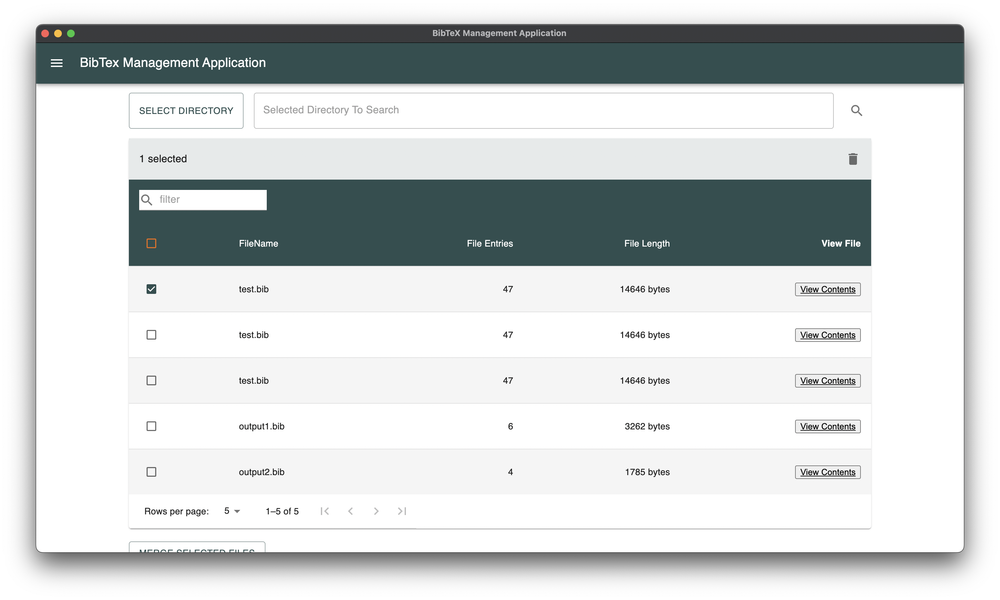
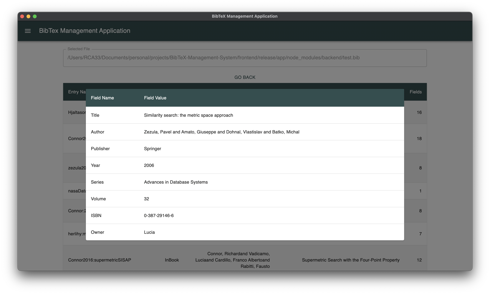
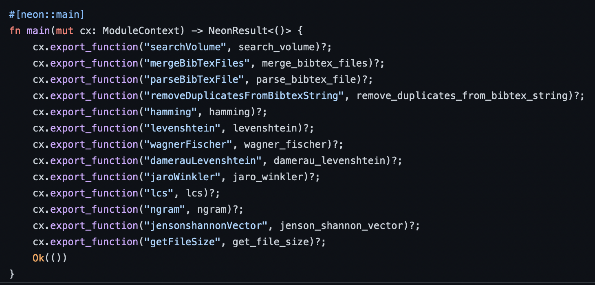

[Github](https://github.com/rupert648/BibTeX-Management-System)

**Technologies:** Rust, Electron, React, NeonJS

Main Homepage           |  BibTeX file page
:-------------------------:|:-------------------------:
  |  

## About 
 BibTeX has become the industry standard when it comes to managing, storing, and rendering reference lists when working under the guise of the LaTeX markup language. Its importance is clear when large numbers of references are being managed such as in theses or research papers. Although high-level reference management tools with BibTeX support exist, the goal of this project was to create a lightweight alternative that focused on delivering a specified range of features to aid in the collation and output of a large number of BibTeX files into a single, accumulated file. A priority focus of this project came in the form of choosing a well-suited similarity metric to compare and identify duplicate and near-duplicate BibTeX entries by analysing and implementing a range of approximate string matching algorithms. The understanding and findings derived from this analysis work were then applied to the context of this application and used to implement a sophisticated BibTeX file merging algorithm, alongside an accompanying graphical user interface to provide straightforward access to this functionality.
##### Complexity Analysis
A key part of achieving high performance in this application was to perform complexity analysis on a range of string matching algorithms, then combine the findings of said analysis with the practical quality of each algorithm - then using this conduced information to make an informed choice on which algorithm to use for the final application.

##### Algorithm implemetation
Many of the algorithms implemented were either derived directly from the application paper, or at best converted from pseudo code into performant rust code. some of these algorithms being implemented in rust was even novelty - such as the implementation of Richard Connor et als algorithm.

Below shows some of the algorithms implemented, as well as some other functions exposed to JS.

##### Native Application
Producing a well designed clear UI to give the user access to the complex mechanisms supporting the project was key to this projects success. A part of this project was therefore creating a easy to use Desktop application GUI. This was done using react on an electron application.

